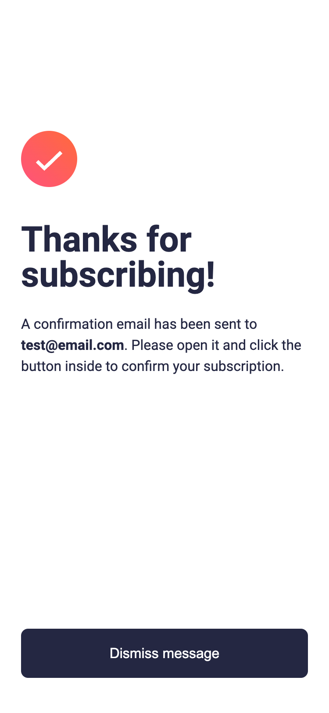

# Frontend Mentor - Newsletter sign-up form with success message solution

This is a solution to the [Newsletter sign-up form with success message challenge on Frontend Mentor](https://www.frontendmentor.io/challenges/newsletter-signup-form-with-success-message-3FC1AZbNrv). Frontend Mentor challenges help you improve your coding skills by building realistic projects.

## Table of contents

- [Overview](#overview)
  - [The challenge](#the-challenge)
  - [Screenshot](#screenshot)
  - [Links](#links)
- [My process](#my-process)
  - [Built with](#built-with)
  - [What I learned](#what-i-learned)
  - [Continued development](#continued-development)
  - [Useful resources](#useful-resources)
- [Author](#author)

## Overview

### The challenge

Users should be able to:

- Add their email and submit the form
- See a success message with their email after successfully submitting the form
- See form validation messages if:
  - The field is left empty
  - The email address is not formatted correctly
- View the optimal layout for the interface depending on their device's screen size
- See hover and focus states for all interactive elements on the page

### Screenshot

|            Mobile designed at 375px:             |           Desktop designed at 1440px:            |
| :----------------------------------------------: | :----------------------------------------------: |
|          |         |
|             Mobile (succcess state):             |             Desktop (active state):              |
|  |  |

### Links

- Solution URL: [https://github.com/elisilk/newsletter-signup-with-success-message](https://github.com/elisilk/newsletter-signup-with-success-message)
- Live Site URL: [https://elisilk.github.io/newsletter-signup-with-success-message/](https://elisilk.github.io/newsletter-signup-with-success-message/)

## My process

### Built with

- Semantic HTML5 markup
- CSS custom properties
- Flexbox
- CSS Grid
- Mobile-first workflow
- Fluid typography

### What I learned

- [MDN Web Docs' article on client-side form validation](https://developer.mozilla.org/en-US/docs/Learn/Forms/Form_validation)
- [Styling lists](https://developer.mozilla.org/en-US/docs/Learn/CSS/Styling_text/Styling_lists) - Needed to replace the standard bullets with the SVGs
- [Placeholder](https://developer.mozilla.org/en-US/docs/Web/HTML/Attributes/placeholder) - the placeholder text in an input field
- [How to Style CSS Focus Outline](https://joyofcode.xyz/css-focus-outline) - A better way to style focus outlines using box shadows
- [When do the :hover, :focus, and :active pseudo-classes apply?](https://bitsofco.de/when-do-the-hover-focus-and-active-pseudo-classes-apply/)
- [Advanced CSS-only Input Fields — Interactive, Animated, Validated](https://matemarschalko.medium.com/advanced-css-only-input-fields-interactive-animated-validated-d7ecff3cde8c) - love this approach and clear explanations, even though I am using a bit of Javascript. I created [a CodePen](https://codepen.io/silk0346/pen/eYqOqBQ) to follow along with the post.

### Continued development

Hmm 🤔

### Useful resources

- [MDN Web Docs for CSS](https://developer.mozilla.org/en-US/docs/Web/CSS) - Went here a lot to reference the different CSS properties and the shorthands, and all the great explanations about best practices.

## Author

- Website - [Eli Silk](https://github.com/elisilk)
- Frontend Mentor - [@elisilk](https://www.frontendmentor.io/profile/elisilk)
